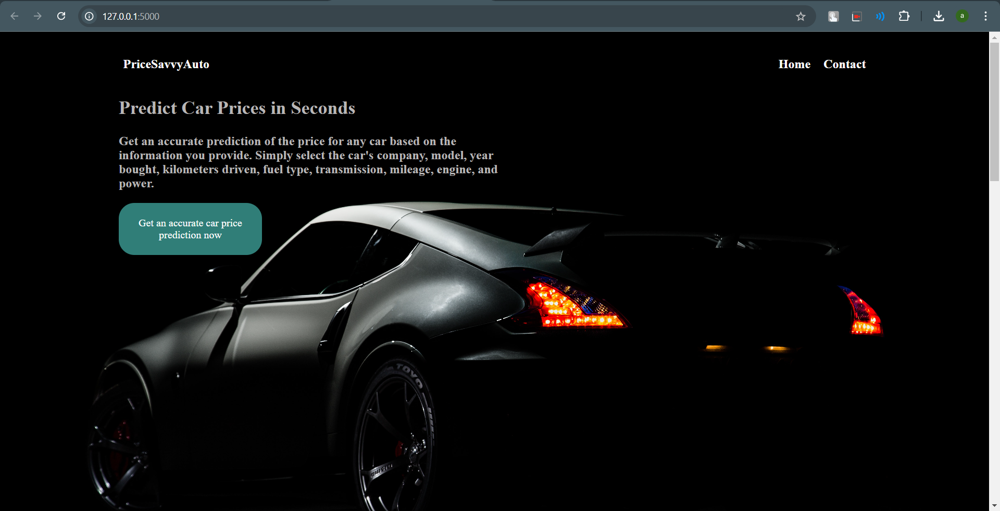
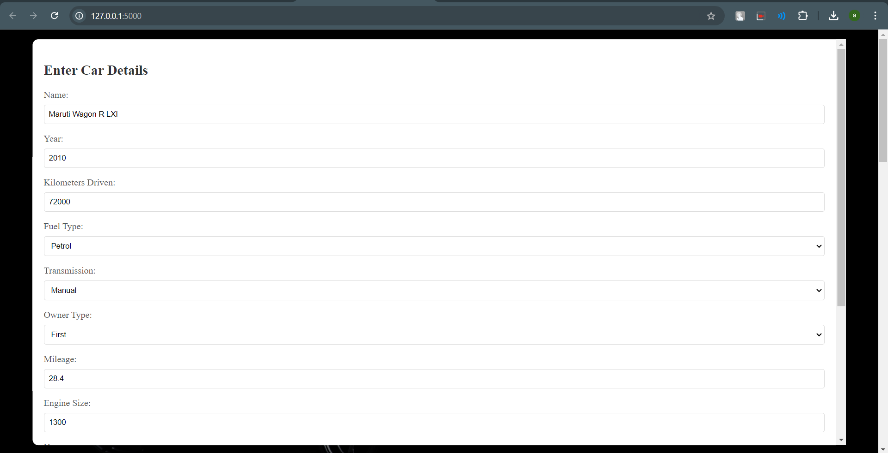
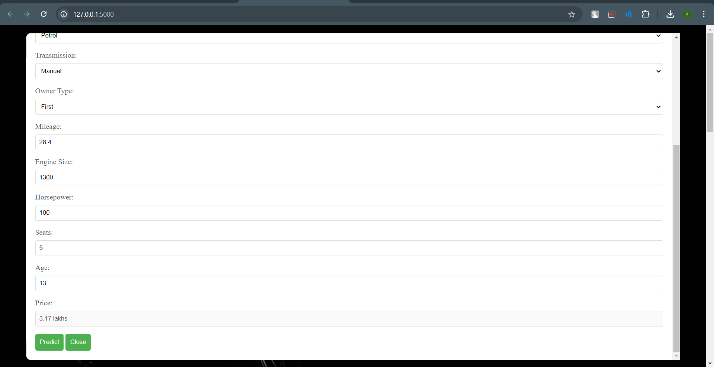

# Car Price Prediction

This project is a web application that predicts the price of a used car based on various features like kilometers driven, fuel type, transmission, owner type, mileage, engine size, horsepower, and the number of seats. The prediction model is built using a RandomForestRegressor, trained on a dataset containing historical car data.

## Overview

The objective of this project is to provide an accurate estimation of used car prices. The application takes input details about the car and predicts its market value using a machine learning model. This tool can be useful for both buyers and sellers in the automotive market.
### Welcome Screen
 

## Dataset

The dataset consists of the following features:
- **Name**: The name and model of the car.
- **Year**: The manufacturing year of the car.
- **Kilometers_Driven**: The total kilometers driven by the car.
- **Fuel_Type**: The type of fuel used by the car (CNG, Diesel, Petrol, etc.).
- **Transmission**: The transmission type (Manual/Automatic).
- **Owner_Type**: The type of ownership (First, Second, etc.).
- **Mileage**: The mileage offered by the car.
- **Engine_Size**: The engine capacity of the car in cubic centimeters.
- **Horsepower**: The power output of the car in horsepower.
- **Seats**: The number of seats in the car.
- **Price**: The price of the car.

## Data Preprocessing

- **Missing Values**: Missing values were handled by imputing them with the mean value of the respective columns.
- **Feature Scaling**: The `Kilometers_Driven` feature was scaled using `StandardScaler` to normalize the data.
- **Feature Encoding**: Categorical features like `Fuel_Type`, `Transmission`, and `Owner_Type` were encoded using mapping dictionaries.

## Modeling and Performance

The model used for prediction is a RandomForestRegressor, which was selected for its accuracy and robustness. The dataset was split into training and testing sets, with the model trained on 80% of the data. The performance was evaluated using the Mean Squared Error (MSE).

- **Model Performance**: The RandomForestRegressor achieved a low Mean Squared Error, making it suitable for predicting car prices with reasonable accuracy.

## Deployment Technologies Used

The web application was built using the following technologies:
- **Flask**: A lightweight web framework for Python, used to create the web interface and handle user requests.
- **Joblib**: For saving and loading the trained model and scaler.
- **HTML/CSS**: For the front-end design of the web application.
- **Pandas/NumPy**: For data manipulation and preprocessing.
- **Scikit-learn**: For model building, training, and evaluation.

## Results

The model successfully predicts the price of a used car based on the input features. For example:
- A 2010 Maruti Swift VDI BSIV with 72,000 kilometers driven, manual transmission, and first ownership predicted a price of ₹1.75 lakhs.
- A 2015 Hyundai Creta 1.6 CRDi SX Option with 41,000 kilometers driven, manual transmission, and first ownership predicted a price of ₹12.5 lakhs.

### Output Screen 1

### Output Screen 2

The application provides a user-friendly interface where users can input car details and get an estimated price, helping them make informed decisions.
